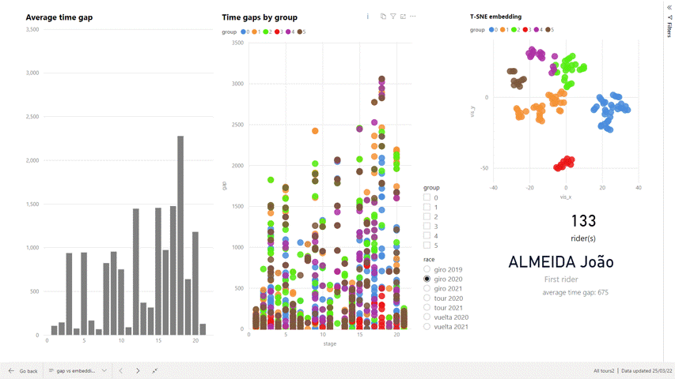
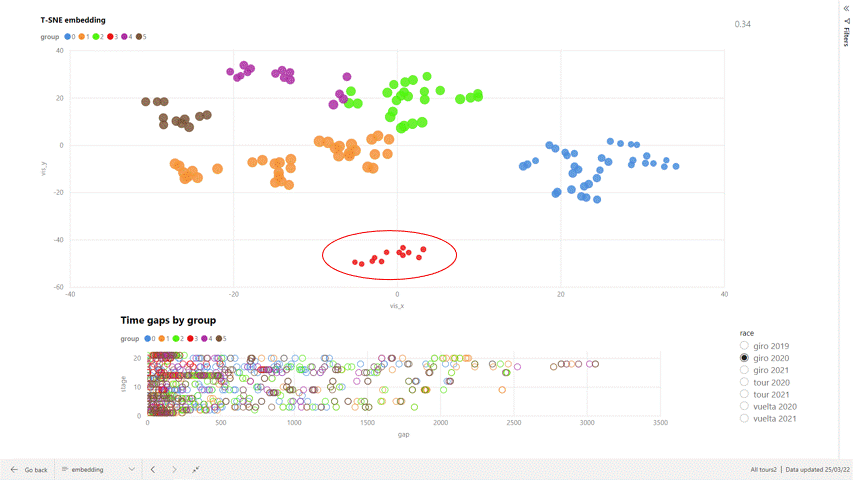
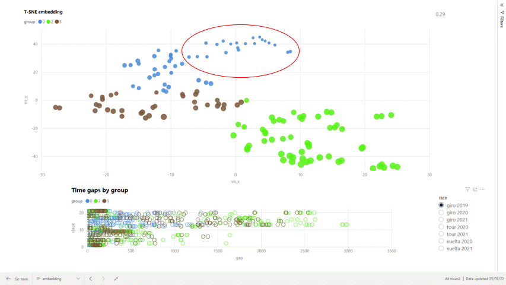
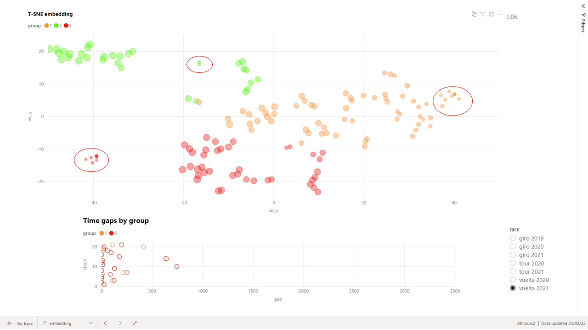

# Power BI report on Bayesian Gaussian model grouping of T-SNE embedding of riders in grand tours

Using Power BI to analyse the groupings produced by https://github.com/Longs/Cycling

Looking at the grouping of the embedding produced by the results for the 2020 Giro d'Italia:

[]

* Group 3 are the best riders in the tour
* Group 1 are "domestiques" who typically work early on in the stage and then trail in within the time limit
* Group 2 are also domestiques but don't do as badly as group 1
* Group 4 are better than average riders who seem to have found stage 18 particularly difficult
* Group 5 seem to have performed better than average on stages 16 and 20 and worse than average on stage 17
* Group 0 are better than average riders who are not on the same level as the elite riders in group 3

The combination of BGM clustering and T-SNE embedding seems to have worked well for this example. In the following plot the marker size indicates the rider's average gap to the winner in each stage: 

[]

Group 3 have the smallest markers and so are the best riders

Looking at the other grouped embeddings:

* All 3 races in 2020 produce a single group encompassing all of the best riders

[]

One possible explanation for this is that the grand tours in 2020 were held over a very compressed timescale due to covid, reducing the overall quality of the riders, meaning that the performances of the elite riders were markedly superior to the rest

* The 2019 Giro and the Tour and Giro in 2021 have all the best riders in a single group but this generally also contains less elite riders:

[]

* The embedding for the Vuelta in 2021 is interesting as there are 3 distinct clusters of elite riders. The large distance between these groups is not meaningful, however the fact that they are not in the same neighbourhood group is - it means that their performances (as measured by time gap) are sufficiently different that they do not need to be in the same neighbourhood when embedded:

[]

